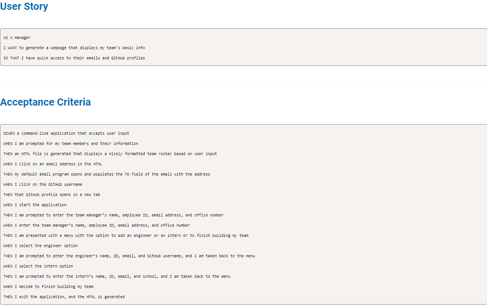

# Team profile generator      
# Description 

This application takes information about employees on a software engineering team and generate3s an HTML webpage that displays information for each person. Once webpage cis  created  user can have quick access to employee's Github profile by clicking  on  their  Github name . Once user clicks on employees email  default email program will open and MAIL TO: fiels will be autopopulated ut
# Table of content 
* [Installation](#installation)
* [Usage](#usage) 
* [Links](#links) 
* [Tests](#tests) 
* [Questions](#questions) 

# Installation 

#### Install Node.js, inquierer 8.2.4 (npm I inquierer@8.2.4)
# Usage 

# Links
[Github Repository Link](https://github.com/Jelenarog/Team-Profile-Generator) 
[Click here to see Demo](https://github.com/Jelenarog/Team-Profile-Generator) 
# License 

This application is covered under MIT, to find more information about it click on https://choosealicense.com/licenses/mit/. 

# Tests 

The following is needed to run the rest:

#### node index.js
# Questions 

If you have any additional questions you can reach me at jelena.rogic90@gmail.com. 

Link to my Github profile: https://github.com/Jelenarog
